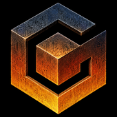
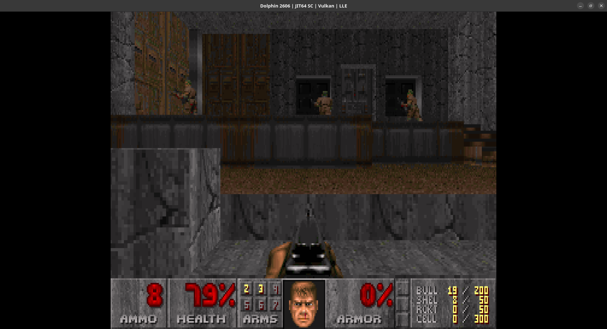

<p align="center">
  
</p>

# DoomCube

Since there wasn't a version of DOOM for the Nintendo GameCube with source
code available, I decided to fill that gap.

DoomCube is a native GameCube port of DoomGeneric with GameCube controller,
Memory Card, audio, launcher, and native disc filesystem support.

## Supported games

DoomCube currently supports:

- DOOM Shareware
- The Ultimate DOOM
- DOOM II
- Final DOOM: TNT - Evilution
- Final DOOM: The Plutonia Experiment

Commercial IWADs are not distributed with DoomCube.

Supported IWAD filenames are:

```text
doom1.wad
doom.wad
doom2.wad
tnt.wad
plutonia.wad
```

If you do not own DOOM, DoomCube's player-side disc builder can optionally
download and verify DOOM Shareware v1.9 automatically.

> **Warning**
>
> Memory Card save behaviour has not yet been tested on original GameCube
> hardware. It may corrupt save data or the Memory Card.
>
> DoomCube's current Memory Card save file uses 116 blocks.

# Running

## Release package

The recommended way for players to use DoomCube is with a release ZIP.

A DoomCube release contains the prebuilt GameCube executable, apploader,
native disc-image builder, launcher artwork, TiMidity runtime data, and the
player-side `pack.py` utility.

The release directory looks roughly like this:

```text
DoomCube/
├── pack.py
├── WADs/
├── PWADs/
├── DEH/
└── runtime/
    ├── doomcube.dol
    ├── apploader.bin
    ├── mkdoomcube.py
    ├── launcher/
    │   └── doomcube.bmp
    └── timidity/
```

No commercial IWADs are included.

Place any supported IWADs you own in:

```text
WADs/
```

Optional PWADs can be placed in:

```text
PWADs/
```

Optional DeHackEd patches can be placed in:

```text
DEH/
```

Then run:

```bash
python3 pack.py
```

If no supported IWAD is present and the script is running interactively,
DoomCube will offer to download DOOM Shareware v1.9.

The downloaded shareware WAD is verified before use.

A successful build produces:

```text
DoomCube.iso
```

This is a native GameCube disc image and can be opened directly in Dolphin or
used with compatible GameCube homebrew loaders.

## Dolphin

Open the generated:

```text
DoomCube.iso
```

in Dolphin.

If you use the Flatpak version of Dolphin and the image is stored somewhere
the sandbox cannot access, such as a temporary directory, expose that
directory explicitly.

For example:

```bash
flatpak run \
    --filesystem=/path/to/DoomCube:ro \
    org.DolphinEmu.dolphin-emu \
    /path/to/DoomCube/DoomCube.iso
```

For development builds from the source tree, the recommended test command is:

```bash
make test
```

This will:

1. clean the previous build
2. build DoomCube
3. build the DoomCube GameCube apploader
4. stage the runtime files
5. create a native GameCube disc image
6. launch the image in the Flatpak version of Dolphin

DoomCube currently uses the GameCube disc filesystem as its canonical runtime
layout.

Runtime files are loaded from paths such as:

```text
dvd:/data/wad/
dvd:/data/pwad/
dvd:/data/deh/
dvd:/data/timidity/
dvd:/launcher/
```

Bare-DOL SD card loading is not currently the canonical runtime path.

## Original GameCube hardware

Original GameCube hardware has not yet been tested.

The native disc image produced by DoomCube is intended to be compatible with
GameCube hardware and compatible loaders, but real-hardware behaviour still
needs validation.

In particular, Memory Card saving has not yet been validated on original
hardware.

# Building from source

DoomCube uses:

- devkitPPC
- libogc2
- SDL2
- SDL2_mixer
- Python 3
- cubeboot-tools

## devkitPro and libogc2

First install devkitPro according to the official Getting Started guide:

https://devkitpro.org/wiki/Getting_Started

Then add the libogc2 repositories described here:

https://github.com/extremscorner/pacman-packages

Edit:

```text
/opt/devkitpro/pacman/etc/pacman.conf
```

and add the following above `[dkp-libs]` and `[dkp-linux]`:

```ini
[libogc2-devkitpro]
Server = https://packages.libogc2.org/devkitpro/linux/$arch
Server = https://packages.extremscorner.org/devkitpro/linux/$arch
```

Update the devkitPro packages:

```bash
sudo dkp-pacman -Syuu
```

Install the GameCube libraries required by DoomCube:

```bash
sudo dkp-pacman -S \
    libogc2 \
    libogc2-sdl2 \
    libogc2-sdl2_mixer-full
```

On Debian/Ubuntu, also make sure Python 3, Git and wget are installed:

```bash
sudo apt install python3 git wget
```

## cubeboot-tools

DoomCube uses parts of Extrems' cubeboot-tools to build its GameCube
apploader.

Clone it into `build-deps`:

```bash
mkdir -p build-deps

git clone \
    https://github.com/extremscorner/cubeboot-tools.git \
    build-deps/cubeboot-tools
```

The `build-deps/` directory is intentionally ignored by Git.

DoomCube's modified apploader source is tracked separately at:

```text
tools/native-gcm/apploader.c
```

When a native image or player release is built, DoomCube copies this source
into the cubeboot-tools build directory, builds `apploader.bin`, and uses the
result when constructing the native GameCube image.

# WADs

For source-tree development, place IWADs in:

```text
data/wad/
```

Supported filenames are:

```text
doom1.wad
doom.wad
doom2.wad
tnt.wad
plutonia.wad
```

Only WADs present when the disc image is built will be included.

The DoomCube launcher automatically detects which supported games are present
on the disc.

Commercial IWADs should never be committed to the DoomCube repository or
included in release archives.

# PWADs and DeHackEd patches

Optional PWAD files can be placed in:

```text
data/pwad/
```

Optional DeHackEd patches can be placed in:

```text
data/deh/
```

For player release packages, use the corresponding:

```text
PWADs/
DEH/
```

directories next to `pack.py`.

# Music

DoomCube converts DOOM's MUS music to MIDI at runtime and plays it through
SDL2_mixer's TiMidity backend.

The TiMidity implementation is provided by SDL2_mixer/libogc2, while the
General MIDI instrument patch set is stored as runtime data on the GameCube
disc.

DoomCube release ZIPs include the required TiMidity runtime data, so players do
not need to install the instrument set separately.

Developers building from the source tree need the TiMidity runtime data in:

```text
data/timidity/
```

The SDL_mixer TiMidity instrument set can be installed with:

```bash
mkdir -p data/timidity
cd data/timidity

wget https://www.libsdl.org/projects/old/SDL_mixer/timidity/timidity.tar.gz
tar -xzf timidity.tar.gz

cp -a timidity/. .

rm -rf timidity
rm timidity.tar.gz

sed -i '4i dir dvd:/data/timidity\n' timidity.cfg

cd ../..
```

Verify that the configuration contains:

```text
dir dvd:/data/timidity
```

with:

```bash
grep -n '^dir ' data/timidity/timidity.cfg
```

The instrument set should contain 192 `.pat` files:

```bash
find data/timidity -iname '*.pat' | wc -l
```

Expected output:

```text
192
```

# Build targets

## Build the DOL

```bash
make
```

This creates a versioned GameCube executable similar to:

```text
doomcube-v0.1.0-dev-xxxxxxxx.dol
```

The Git commit hash is included in the filename.

If the source tree contains uncommitted changes, the build ID also contains:

```text
-dirty
```

## Build the native GameCube disc image

```bash
make iso
```

DoomCube builds a native GameCube disc image rather than an ISO9660 filesystem.

The image contains:

```text
GameCube boot header
DoomCube apploader
main DOL
native GameCube FST
data/wad/
data/pwad/
data/deh/
data/timidity/
launcher/doomcube.bmp
```

The image is constructed by:

```text
tools/native-gcm/mkdoomcube.py
```

The resulting filename is versioned and will look similar to:

```text
doomcube-v0.1.0-dev-xxxxxxxx.iso
```

## Build and launch in Dolphin

```bash
make test
```

This performs a clean rebuild, builds the apploader, creates the native
GameCube disc image, and launches it in the Flatpak version of Dolphin.

## Build a player release

```bash
make release
```

This creates a self-contained player release under:

```text
dist/
```

The release process:

1. builds DoomCube
2. rebuilds the DoomCube apploader
3. validates the player-side `pack.py`
4. creates a clean release directory
5. copies the prebuilt runtime components
6. copies the TiMidity runtime data
7. creates a versioned ZIP archive

The resulting archive looks similar to:

```text
dist/doomcube-v0.1.0-dev-xxxxxxxx.zip
```

The release archive intentionally contains no IWADs.

Players therefore do not need devkitPPC, libogc2, cubeboot-tools or a
PowerPC compiler. They only need Python 3 and a supported IWAD, or they can
allow `pack.py` to acquire the verified shareware WAD automatically.

## Clean

```bash
make clean
```

# Controls

Default controls:

- Forward = Left analog stick up
- Backpedal = Left analog stick down
- Strafe left = Left analog stick left
- Strafe right = Left analog stick right
- Turn left = C-stick left
- Turn right = C-stick right
- Run = L trigger
- Fire = R trigger
- Use = A
- Back = B
- Next weapon = X
- Previous weapon = Y
- Map = Z

Controls can be customised in the in-game options menu.

# Features

## Implemented

- DoomGeneric running natively on the Nintendo GameCube
- DOOM Shareware, Ultimate DOOM, DOOM II, TNT and Plutonia support
- Multi-IWAD launcher
- Native GameCube disc image generation
- Native GameCube FST filesystem backend
- Disc-backed WAD loading
- GameCube controller support
- Customisable controls
- GameCube controller rumble
- Sound effects
- MUS-to-MIDI conversion
- MIDI music through SDL2_mixer/TiMidity
- Memory Card save support
- Per-game save handling
- One save slot per game
- DoomCube launcher artwork
- Self-contained player release packaging
- Optional verified DOOM Shareware acquisition
- Player-side native GameCube image generation

## Known Issues

- DoomCube has not yet been tested on original GameCube hardware.
- Memory Card behaviour has therefore not yet been validated on real hardware.
- Bare-DOL execution is not currently the canonical runtime configuration.

## Could Have

- Fully fledged Memory Card save file with GameCube icon/banner metadata
- Further disc I/O and cache optimisation
- SD Gecko / SD2SP2 runtime filesystem support
- Game Boy Advance cable support for displaying the automap
- Local four-player split-screen multiplayer
- Online multiplayer

# Screenshots

## Dolphin

